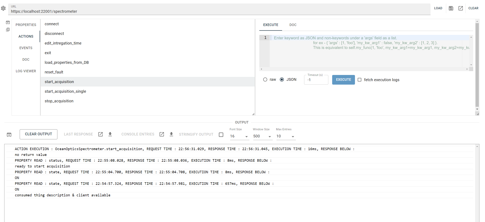

# Thing Control Panel

Admin control panel in React for things implemented with [`hololinked`](https://github.com/VigneshVSV/hololinked).
Allows developing of server backend or test properties, actions and events. 

### Installation

```npm install . ``` or ```npm install . --force``` to install the requirements and dependencies <br/>
```npm run dev``` to run as react app <br/>
```npm run dev -- --host --port 12345``` to run on the network <br/>
```npm run build``` to build and host with your own HTTP server <br/>

### Usage

The GUI is only coming up, its still rough on the edges. 

Insert the address of the device (https://{address of host}/{instance name of the thing}), then press load. If self signed
HTTP(s) certificate is used, you might have to give permission to the browser. Its suggested to use Mozilla as Chrome seems
to have issues with self-signed certificates since version 119. 

After you load, your defined properties, actions and events are shown. You can freely interact with them as shown below:





Its recommended to install a JSON viewer for your web browser, like [this](https://chromewebstore.google.com/detail/json-viewer/gbmdgpbipfallnflgajpaliibnhdgobh).

You can then load the console entries in a new tab and read it in a correctly formatted way. Edit the number of entries that can stored in the console output
by setting the value of "Max Entries" from the drop down. More entries will take more RAM, but useful for capturing events or eventful measurement data directly 
in the GUI. 

###### Contributors Welcome, please check issues. 

### To Do

- Log Viewer does not work, although its almost complete. 
- Improvements in viewing TD, especially for events as its shown right below 
- Responsive layout for smaller screens
- Packaging in Electron

Possible further ideas
- Database viewer (i.e. viewer of properties that are stored in database)
- Observe all properties, subscribe all events
- Graphical data acquisition into file using events

Contributors welcome. There are also similar projects available from Web of Things community. 
