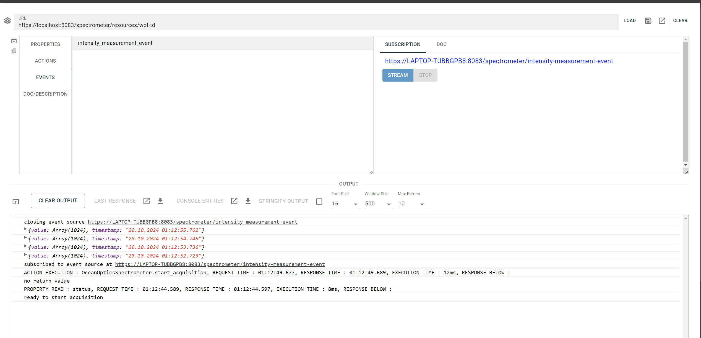

# Thing Control Panel

Admin control panel in React for Things having a standard WoT Thing Description with HTTP protocol binding or 
implemented with [`hololinked`](https://github.com/VigneshVSV/hololinked). Suitable for development of server backend, 
test properties, actions and events or generic use purposes to interact with the Thing. 

The GUI is only coming up, its still rough on the edges. If anything is not upto your standard or buggy/broken,
 please do feel free to reach me, or open a discussion in the discussions tab or an issue. 
<br>
[](mailto:vignesh.vaidyanathan@hololinked.dev) [](https://hololinked.dev/contact) <br>

### Installation

```npm install . ``` or ```npm install . --force``` to install the requirements and dependencies <br/>
```npm run dev``` to run as react app <br/>
```npm run dev -- --host --port 12345``` to run on the network <br/>
```npm run build``` to build and host with your own HTTP server <br/>

This application is written in plain React and therefore CSR. It is intended to keep it like that.

### Usage

Insert the address of the device or the endpoint of the thing description, then press load. If you are using your own Thing server runtime or a standard location to store
your thing descriptions, click on settings (cog-wheel on top left) and edit "default endpoint for fetching thing description" to suit
your requirements. The address enetered in the address bar will then be considered as base URL and the default endpoint will be appended.
Store your addresses in the browser using the store icon on the top right so that you dont have to type the address everytime - this storage is browser specific.  

If you are using `hololinked` as the server, the default endpoint must be one of `/resources/portal-app`, `/resources/wot-td` or `/resources/wot-td?ignore_errors=true`, and
enter the Thing addresss as `http(s)://{address of host}/{instance name of the thing}`.

If self signed HTTP(s) certificate is used, you might have to give permission to the browser. You can open the endpoint in new tab using the new tab button on top right. 
This should fetch the thing description without fail. Sometimes, the permission given for self signed certificate given may not match the form entries, so please do make
sure you can atleast fetch/read one property if things are still not working.  

After you load, your defined properties, actions and events are shown. You can freely interact with them as shown below:




Supported ops are
- read, write & observe property
- invoke action
- subscribe & unsubscribe event 
  
Whenever an operation is executed, the output is printed in the console below. 
Its recommended to install a JSON viewer for your web browser, like [this](https://chromewebstore.google.com/detail/json-viewer/gbmdgpbipfallnflgajpaliibnhdgobh).

Credentials or security definitions are not supported yet, sorry, please feel free to add support for it. The client is built on top of node-wot so all
node-wot features can, in principle, be supported. 

You can then load the console entries in a new tab and read it in a correctly formatted way or download it for other purposes. 
Edit the number of entries that can stored in the console output by setting the value of "Max Entries" from the drop down. 
More entries will take more RAM, but useful for capturing events or eventful measurement data directly in the GUI. 

### Configuration - app.config.ts

This file contains certain configurations that can be modified according to your requirements:

- `useHTTPs` - when set to `true`, the app will rendered with a self signed SSL certificate from vite. 

### To Do

##### Contributors welcome. Feel free to also propose new ideas or add more ops. There are also similar projects available from Web of Things community. 

- Improvements in viewing TD, especially for events as its shown right below 
- Settings are not saved correctly in browser
- Responsive layout for smaller screens
- Packaging in Electron
- Observe all properties, subscribe all events & top level forms

Possible further ideas
- Database viewer (i.e. viewer of properties that are stored in database)
- Log Viewer does not work correctly, although its almost complete. 
- Graphical data acquisition into file using events


